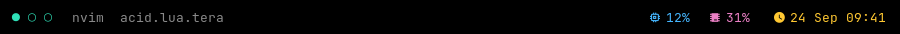
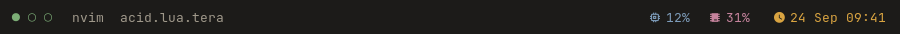
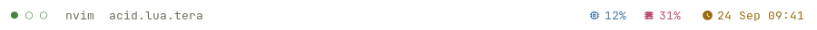

# Acid for Waybar

Generated from [acid-theme/acid](https://github.com/acid-theme/acid) — open issues
and pull requests there.

<details>
<summary>Screenshots</summary>

| Acetic | Citric | Lactic |
| --- | --- | --- |
|  |  |  |

</details>

## Install

```sh
curl -fsSLo ~/.config/waybar/acid-acetic.css \
  https://raw.githubusercontent.com/acid-theme/waybar/main/acid-acetic.css
```

Import it above the rules that use it, so a later definition can override it:

```css
@import "acid-acetic.css";

window#waybar {
    background-color: @base;
    color: @text;
    border: 1px solid @surface1;
}
```

Coming from a Catppuccin stylesheet, three names have no Acid equivalent:
`@sky` is `@aqua`, `@mauve` is `@purple`, and `@maroon` is `@orange` or `@red`
depending on whether it marked a warning or an error. GTK reports no error for a name it
does not know, so a leftover one leaves that widget unstyled.

## Credits

[@ssiyad](https://github.com/ssiyad)
